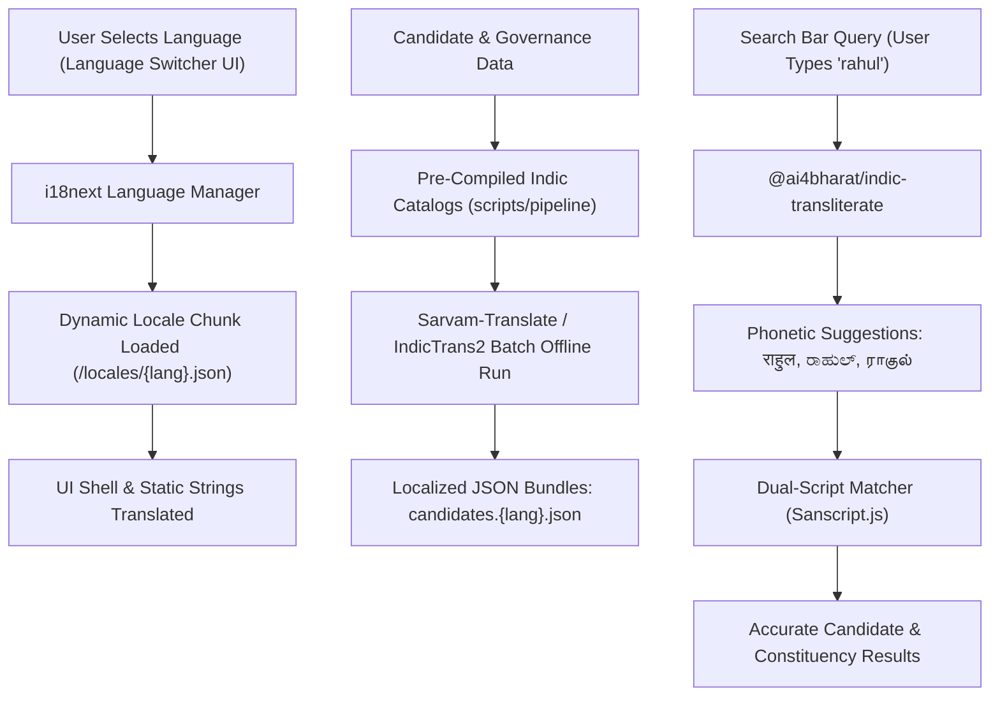

# NetaPulse: Multilingual Indian Language Architecture & Implementation Plan

> **Vision**: Transform NetaPulse into a truly pan-Indian, accessible civic portal supporting India's linguistic diversity starting with **Hindi (हिन्दी)**, **Marathi (मराठी)**, **Bengali (বাংলা)**, **Tamil (தமிழ்)**, **Kannada (ಕನ್ನಡ)**, and **Gujarati (ગુજરાતી)**.

---

## 1. Executive Summary & Recommended Stack

Based on deep web research of modern Indic NLP libraries, government platforms (Digital India / Bhashini), and React ecosystem tools, the optimal architecture for NetaPulse combines **compile-time batch translation** for governance data with **lightweight client-side i18n & phonetic transliteration**:

| Layer | Tool / Library | Role & Rationale |
|---|---|---|
| **Static UI Framework** | `i18next` + `react-i18next` | Zero-dependency core, modular namespaces (`common`, `dossier`, `funds`, `affidavits`), dynamic lazy-loading per language bundle. |
| **Batch Pipeline Translation** | **Sarvam-Translate** / **AI4Bharat IndicTrans2** | State-of-the-art open-weights models fine-tuned for Indic context. Generates accurate translations of political manifestos, promise categories, and civic insights during pipeline builds. |
| **Interactive Search & Input** | `@ai4bharat/indic-transliterate` & `react-transliterate` | Enables users to type phonetically in English (e.g., `modi` -> `मोदी`, `yogi` -> `योगी`, `bangalore` -> `ಬೆಂಗಳೂರು`) on standard mobile/desktop keyboards. |
| **Cross-Script Name Search** | `@indic-transliteration/sanscript` | Programmatic transliteration to index candidate and constituency names across English, Devanagari, Bengali, Tamil, Kannada, and Gujarati for instantaneous search. |
| **Typography & Fonts** | Google Fonts (`Noto Sans Indic` series) | Modern, clean rendering with proper glyph conjunctive ligatures for complex Indic scripts. |
| **Number & Currency Formatting** | Native `Intl.NumberFormat` | Standard Indian numbering system (Lakhs & Crores: `₹12,45,000` / `१२,४५,०००`) with native browser support. |

---

## 2. Target Languages & Script Specifications

| Language | Native Name | Code | Script | Primary Target States | Recommended Font Stack |
|---|---|---|---|---|---|
| **Hindi** | हिन्दी | `hi` | Devanagari | UP, MP, Bihar, Rajasthan, Haryana, Delhi, HP, UK, Jharkhand, Chhattisgarh | `'Noto Sans Devanagari', 'Inter', sans-serif` |
| **Marathi** | मराठी | `mr` | Devanagari | Maharashtra, Goa | `'Noto Sans Devanagari', 'Inter', sans-serif` |
| **Bengali** | বাংলা | `bn` | Bengali-Assamese | West Bengal, Assam, Tripura | `'Noto Sans Bengali', 'Hind Siliguri', sans-serif` |
| **Tamil** | தமிழ் | `ta` | Tamil | Tamil Nadu, Puducherry | `'Noto Sans Tamil', 'Mukta Malar', sans-serif` |
| **Kannada** | ಕನ್ನಡ | `kn` | Kannada | Karnataka | `'Noto Sans Kannada', sans-serif` |
| **Gujarati** | ગુજરાતી | `gu` | Gujarati | Gujarat, Dadra & Nagar Haveli | `'Noto Sans Gujarati', sans-serif` |
| **English** | English | `en` | Latin | Pan-India (Default) | `'Inter', 'Roboto', sans-serif` |

---

## 3. Architecture Blueprint



---

## 4. Phased Implementation Plan

### Phase 1: Core i18n Infrastructure & Language Selector
1. **Install Dependencies**:
   ```bash
   npm install i18next react-i18next i18next-browser-languagedetector
   ```
2. **Setup Namespaces**:
   - `common.json`: Navigation, search labels, buttons, headers, footer links.
   - `selector.json`: State/district/constituency selection labels, role filters (`Chief Minister`, `Member of Parliament`, `MLA`).
   - `dossier.json`: Performance metrics, criminal disclosures, asset declaration labels, education levels.
   - `funds.json`: MPLADS vs MLA-LADS explanatory badges, ceiling formulas, expenditure metrics.
3. **Language Switcher Component**:
   - Elegant dropdown in the app header next to the Dark Mode toggle with native script labels:
     - 🌐 English
     - हिन्दी (Hindi)
     - मराठी (Marathi)
     - বাংলা (Bengali)
     - தமிழ் (Tamil)
     - ಕನ್ನಡ (Kannada)
     - ગુજરાતી (Gujarati)

### Phase 2: Indic Typography & Script Ligature Styling
- Integrate Google Fonts in `index.html` with optimal sub-resource loading:
  ```html
  <link rel="preconnect" href="https://fonts.googleapis.com">
  <link rel="preconnect" href="https://fonts.gstatic.com" crossorigin>
  <link href="https://fonts.googleapis.com/css2?family=Noto+Sans+Bengali:wght@400;600;700&family=Noto+Sans+Devanagari:wght@400;600;700&family=Noto+Sans+Gujarati:wght@400;600;700&family=Noto+Sans+Kannada:wght@400;600;700&family=Noto+Sans+Tamil:wght@400;600;700&display=swap" rel="stylesheet">
  ```
- Configure dynamic font-family utility in `index.css` matching the active language.

### Phase 3: Intelligent Phonetic Search & Transliteration
1. **Phonetic Typing Support**:
   - Integrate `@ai4bharat/indic-transliterate` or `react-transliterate` into the main search input.
   - Users typing `yogi` in Hindi mode see `योगी आदित्यनाथ` instantly.
2. **Cross-Script Ingestion Pipeline**:
   - Use `@indic-transliteration/sanscript` in pipeline compiler to generate phonetic indices so queries in Latin, Devanagari, or regional scripts match effortlessly.

### Phase 4: Data Catalog Batch Translation
- **Automated Script**: Create `scripts/pipeline/translate_governance_catalogs.py` utilizing **Sarvam-Translate** or **AI4Bharat IndicTrans2** to translate:
  - 243 District Historical Milestones & Governance Challenges.
  - Manifesto promise categories and delivery statuses (*Completed*, *In Progress*, *Stalled*).
  - Sworn legal disclosure crime classifications (*Political Speech*, *Public Demonstration*).
- Store translations in lightweight static subdirectories: `src/locales/{lang}/`.

---

## 5. Verification & Testing Checklist

- [ ] Zero bundle bloat for English users (translations loaded on demand via dynamic `import()`).
- [ ] Script glyphs render correctly without missing conjuncts or broken matras across desktop and mobile browsers.
- [ ] Search functions seamlessly with both English Roman keyboard and native script keyboards.
- [ ] Currency and figures accurately conform to Indian notation (`₹1.25 करोड़` / `₹1.25 Cr`).
- [ ] Verification on local server (`http://localhost:7860/`) and automated test assertions.
